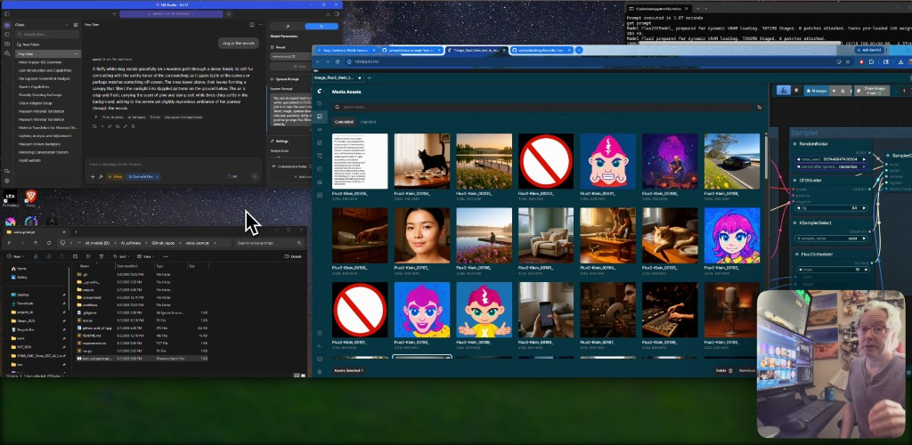

<div align="center">

**Watch the walkthrough**

[**Open the video on YouTube →**](https://www.youtube.com/watch?v=34YuC05p3_A)

The link above and the thumbnail below both go to the same demo.

<a href="https://www.youtube.com/watch?v=34YuC05p3_A"></a>

*Click the thumbnail to open the video.*

</div>

# VoicePrompt

**VoicePrompt** listens to your microphone, transcribes with **Whisper**, sends the line to **LM Studio** for a single detailed **FLUX-style** prompt (see `voiceprompt/lm_system_default.txt`), then queues your **ComfyUI** graph and saves a **PNG** under `outputs/history/`. **Everything stays on your machine** — no cloud API required for the default path.

**Console flow:** The cat on the table **`[You said]`** (transcript) then **`[Enhanced]`** (super detailed FLUX text sent to ComfyUI).
---

## What you need (one-time)

1. **Python 3.10+** — [python.org](https://www.python.org/downloads/) (enable “Add Python to PATH” when offered).
2. **LM Studio** — local LLM + OpenAI-compatible server (default `http://127.0.0.1:1234/v1`).
3. **ComfyUI** — with a workflow exported as **API JSON** (default path: `workflows/voice-prompt_v01.json`).
4. **A microphone.**

---

## Desktop screenshot

<div align="center">



**Stack in the screenshot**

| Role | What’s running |
|------|----------------|
| **LLM** (speech → rich image prompt) | **Meta Llama 3 8B Instruct** — `llama-3-8b-instruct` in [LM Studio](https://lmstudio.ai/) |
| **Image model** (pixels) | **FLUX.2 Klein** in [ComfyUI](https://github.com/comfyanonymous/ComfyUI) |

*You can swap in other local LLMs or Comfy workflows; VoicePrompt only needs an OpenAI-compatible LM server and a workflow JSON with a text node to inject the prompt.*

</div>

---

## First-time setup

### A. Install Python dependencies

From the project folder:

- Double‑click **`start_voiceprompt.bat`**,  
  **or** run:

```bash
py -3 app.py
```

Use **`py -3`** (not guessed `python`) on Windows so you pick the right interpreter. The first run may download Whisper weights.

### B. LM Studio — model + server

1. Open LM Studio.
2. Load your instruct model (e.g. Llama 3 8B or Qwen).
3. Start the **local server** (port **1234** is typical).

### C. ComfyUI

1. Launch ComfyUI (desktop, Pinokio, etc.).
2. Confirm the API port (**8188** by default).

### D. Tell VoicePrompt which LM to call (optional)

If you only load **one** model in LM Studio, VoicePrompt can use the **first** id from `http://127.0.0.1:1234/v1/models`. If multiple models appear, set:

```text
VOICEPROMPT_LM_MODEL=llama-3-8b-instruct
```

(use **your** model’s exact `id` from `/v1/models`).

### E. Workflow path (optional)

Defaults expect **`workflows\voice-prompt_v01.json`** and prompt injection on node **`76`**, field **`value`**. Override if needed:

| Variable | Purpose |
|----------|---------|
| `VOICEPROMPT_COMFY_WORKFLOW` | Path to your API workflow JSON |
| `VOICEPROMPT_COMFY_PROMPT_NODE` | Node id (e.g. `76`) |
| `VOICEPROMPT_COMFY_PROMPT_FIELD` | Field name (e.g. `value`) |

---

## Every session (quick checklist)

| Step | Action |
|------|--------|
| 1 | Start **LM Studio** (model loaded, server on). |
| 2 | Start **ComfyUI**. |
| 3 | Run **`start_voiceprompt.bat`** or `py -3 app.py`. |

At the `voice-prompt>` prompt:

1. **`help`** — command list  
2. **`warmup`** once — preloads Whisper (recommended)  
3. **`start`** — listen; speak, then pause ~1 s so end-of phrase is detected  
4. **`stop`** when finished (or leave **`start`** on for another line)

Mic selection: **`mics`**, then **`mic <n>`**, then **`start`**.

---

## Where images are saved

```
voice-prompt\outputs\history\
```

Files look like **`vp_<timestamp>.png`**. Successful runs also log:

```text
[VoicePrompt] Saved gallery image → ...\outputs\history\vp_....png (... bytes)
```

---

## Troubleshooting

| Problem | Try this |
|---------|----------|
| `No module named …` | `py -3 app.py` or `start_voiceprompt.bat` |
| LM Studio fails / empty reply | Server on? Model loaded? **`VOICEPROMPT_LM_MODEL`** matches `/v1/models`? **`VOICEPROMPT_LM_BASE_URL`** if cloud `OPENAI_BASE_URL` hijacks VoicePrompt |
| Comfy fails | Comfy listening on **8188**? Workflow path and injection node correct? Run the workflow once manually in Comfy |
| Retry same prompt | **`regen`** — last **`[Enhanced]`** text → Comfy again |
| See last error | **`status`** |

---

## Customize prompt rewriting

VoicePrompt sends a fixed **`system`** message loaded from **`voiceprompt/lm_system_default.txt`** plus your transcription as **`user`**. Edit that file to match your tone, length, or model family (still aimed at FLUX-style prompts).

---

## Optional environment variables

| Variable | Meaning |
|----------|---------|
| `OPENAI_BASE_URL` | LM Studio URL (default `http://127.0.0.1:1234/v1`) |
| `VOICEPROMPT_LM_BASE_URL` | Overrides `OPENAI_BASE_URL` for VoicePrompt only |
| `VOICEPROMPT_LM_MODEL` | Model id (optional; else first from `/v1/models`) |
| `VOICEPROMPT_COMFY_HOST` / `VOICEPROMPT_COMFY_PORT` | ComfyUI host/port |
| `VOICEPROMPT_COMFY_WORKFLOW` | Workflow JSON path |
| `VOICEPROMPT_COMFY_OUTPUT_DIR` | Comfy output folder (fallback if HTTP fetch fails) |
| `VOICEPROMPT_OUTPUT_DIR` | Where **`vp_*.png`** copies go |

---

## One-line cheat sheet

LM Studio → ComfyUI → **`start_voiceprompt.bat`** → **`warmup`** → **`start`** → speak → check **`outputs\history`**.
